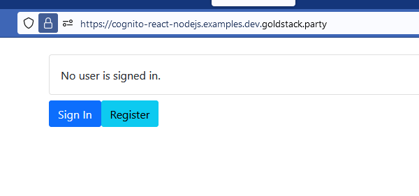

# Cognito Web Application Example Project

This is an example project for an upcoming article on how to provide authentication for a web application using [Amazon Cognito](https://aws.amazon.com/cognito/).

🚀 [Live Demo](https://cognito-react-nodejs.examples.dev.goldstack.party/)



This project was generated using the [Goldstack Project Builder](https://github.com/goldstack/goldstack) from the templates:

- [User Management Template](https://goldstack.party/templates/user-management)
- [Server-Side Rendering Template](https://goldstack.party/templates/server-side-rendering)

## Getting Started

If you want to explore this repository on your local machine, please follow the below instructions. For any questions or feedback, please be welcome to [raise an issue on GitHub](https://github.com/goldstack/goldstack/issues) 🤗 .

### 1. Fork and clone the repository

[Fork this repository](https://docs.github.com/en/get-started/quickstart/fork-a-repo) and then [clone](https://docs.github.com/en/repositories/creating-and-managing-repositories/cloning-a-repository) the fork your local machine.

### 2. Install required local dependencies

A few dependencies need to be available in your development system. Please verify they are present or install them.

- Node v12+
- Yarn v1.22.5+
- Docker v19+

Open a terminal and run the following commands:

```bash
node -v
yarn -v
docker --version
```

This should produce the following output:


If you need to install or update any of the dependencies, please see the following guides:

- [Downloading and installing Node.js and npm](https://docs.npmjs.com/downloading-and-installing-node-js-and-npm)
- [Yarn Installation](https://yarnpkg.com/getting-started/install)
- [Install Docker for Windows](https://docs.docker.com/docker-for-windows/install/) / [Install Docker for Mac](https://docs.docker.com/docker-for-mac/install/)

### 3. Initialise project and install NPM Dependencies

Run `yarn` in your project directory to install and download all dependencies.

The installation process should take around 3-10 minutes depending on the dependencies that need to be downloaded.


You can confirm everything was installed correctly by running `yarn -v`. This should show a yarn version of `3.0.0+`.


### 4. Build modules

Make sure that the project compiles correctly by running `yarn build` your project directory:


Note that this command also ensures that all TypeScript project references are configured correctly.

### 5. Configure VSCode

In order to setup VSCode, open the project in VSCode.

VSCode may prompt you to ask if you trust the authors of the workspace. Respond with Yes.


You may also be asked if you want to install recommended extensions for this workspace. We recommend to do so since the template will be optimised to work with the suggested extensions.


If you want to install the necessary extensions manually, here are links to the extensions required:

- [ESLint](https://marketplace.visualstudio.com/items?itemName=dbaeumer.vscode-eslint)
- [Prettier](https://marketplace.visualstudio.com/items?itemName=esbenp.prettier-vscode)
- [ZipFS](https://marketplace.visualstudio.com/items?itemName=arcanis.vscode-zipfs) (optional)

### 6. Initialise TypeScript

Locate a `.ts` or `.tsx` file in the workspace and open it. When asked whether to use the workspace TypeScript version, click _Allow_.


In the status bar on the bottom right-hand corner of the VSCode editor you should now see _TypeScript_.


### 7. Do Some Local Testing

Open a Terminal in VS code and navigate to the folder: `packages/server-side-rendering`.

Here run the command:

```
yarn watch
```

A server will be started on your local machine that allows you to test the application.

For more information, see the Goldstack documentation:

- [User Management / Development (Client)](https://docs.goldstack.party/docs/templates/user-management#3-development-client-1)
- [User Management / Development (Server)](https://docs.goldstack.party/docs/templates/user-management#4-development-server-1)

### 8. Deploy to Your Own AWS Account

There are a few steps involved for making this project work on your own account. Please see the following documentation for more information:

- [User Management Boilerplate Documentation / 8. Deploy to AWS](https://github.com/goldstack/cognito-nodejs-template/blob/master/README.md#8-deploy-to-aws)
- [Server-Side Rendering Template Documentation / 8. Deploy to AWS](https://github.com/goldstack/react-ssr#8-deploy-to-aws)
